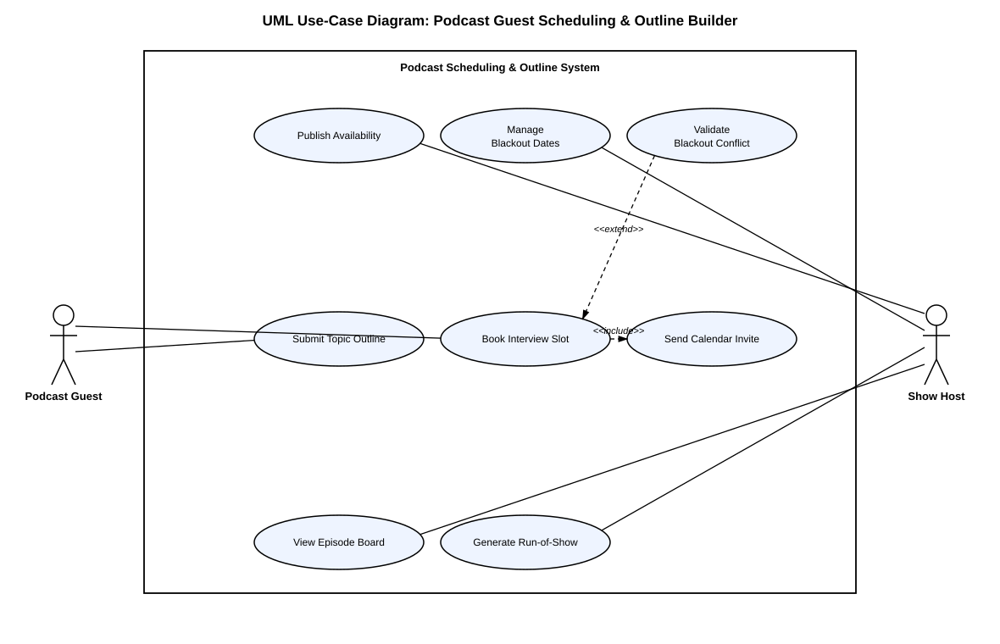

# Lab 1: Requirements Engineering & UML Use-Case Modelling
## Problem Statement #60 — Podcast Guest Scheduling & Outline Builder

**Student:** Pulkit Handa
**SRN:** PES1UG24AM208
**Domain:** Media, Events & Community
**Actors:** Podcast Guest, Show Host

---

### Problem Context
A media production organizer allowing podcast hosts to share booking availability, collect guest talking-point outlines, and generate timestamped run-of-show episode production notes.

### Repository Contents

| File | Deliverable |
|---|---|
| [`requirements.md`](./requirements.md) | Requirements table — 5 Functional Requirements (FR-001–FR-005) and 2 Non-Functional Requirements (NFR-001–NFR-002), each with ID, Type, Description, Priority, Acceptance Criteria, and Rationale. |
| [`use-case-diagram.svg`](./use-case-diagram.svg) | UML Use-Case Diagram modelling both actors, all primary use cases, one `<<include>>` relationship (Book Interview Slot → Send Calendar Invite), and one `<<extend>>` relationship (Validate Blackout Conflict → Book Interview Slot). |
| [`use-case-flow-spec.md`](./use-case-flow-spec.md) | 1-page Use-Case Flow Specification for the core use case **Book Interview Slot**, covering Preconditions, Postconditions, Main Success Scenario, and one Alternate Flow. |

### Use-Case Diagram Preview

